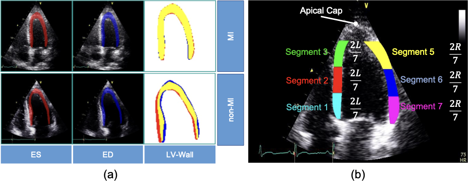
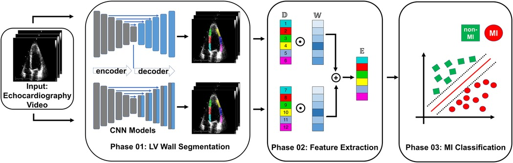

## Set up enviroments
1. Fill out the library in enviroment.yml file
2. Create condata enviroments with prefix
``` conda env create --prefix ./env --file environment.yml ```
3. Activate enviroments
``` conda activate ./env # activate the environment ```
4. Update package
``` conda env update --prefix ./env --file environment.yml --prune # update the environment ```

## Myocardial Infarction Detection in Echocardiography


- (A) Segmentation mask of the LV wall for both an end-systolic frame and an end-diastolic frame, with one case representing an MI and the other case representing a non-MI case in the HCM-QU dataset. 
- (B) Six segments of the LV wall may be used to detect signs of an MI. The label “L” represents the length from the bottom left corner to the apex of the LV, and the label “R” represents the length from the bottom right corner to the apex of the LV.


## Overview of framework


 Overview of the proposed MI detection framework. 
- In the phase 01 block, blue blocks represent convolutional layers, gray blocks represent transposed convolutional layers, and blue arrows represent the skip connections between the encoder and decoder.
- In the phase 02 block, 𝔻 refers to the displacement of the heart muscle during a cardiac event, 𝕎 refers to the weight assigned to different features within the ensemble model used for detection, and 𝔼 refers to the ensemble of features used to identify MI.

Please cite the paper, as below, when using this repository:
```
@article{nguyen2023ensemble,
  title={Ensemble learning of myocardial displacements for myocardial infarction detection in echocardiography},
  author={Nguyen, Tuan and Nguyen, Phi and Tran, Dai and Pham, Hung and Nguyen, Quang and Le, Thanh and Van, Hanh and Do, Bach and Tran, Phuong and Le, Vinh and others},
  journal={Frontiers in Cardiovascular Medicine},
  volume={10},
  year={2023},
  publisher={Frontiers Media SA}
}
```